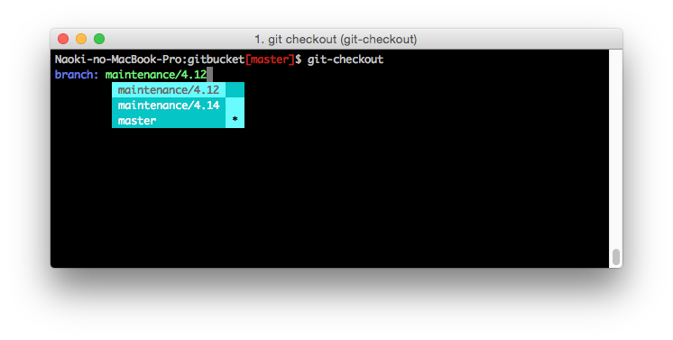

git-checkout
========
Interactive CLI tool to checkout git branch.

```
go get github.com/takezoe/git-checkout
```

You can choose a branch from all local and remote branches of your git repository using `git-checkout` command.



If you input a local branch name, it's checked out simply. If you input a remote branch name, it's checked out as a local branch.

Thanks to [go-prompt](https://github.com/c-bata/go-prompt) library.

